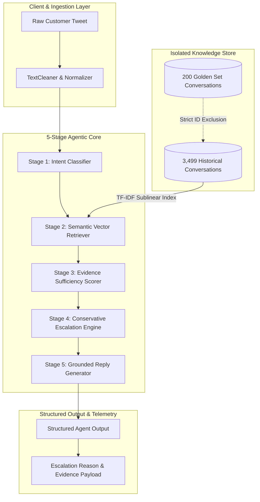

# System Architecture & Technical Specifications

This document details the architectural design, component interactions, latency profile, data flow, and safety guardrails for the `@AppleSupport` AI Support System.

---

## 1. High-Level System Architecture



---

## 2. Component Specifications

### 2.1 Preprocessing & Normalization (`src/preprocessing/text_cleaner.py`)
- **Purpose**: Cleans raw Twitter text while preserving diagnostic signals.
- **Operations**:
  - Replaces curly quotes, typographical dashes, and irregular whitespace.
  - Strips `@AppleSupport` and anonymized user IDs (`@115858`) for semantic indexing while retaining them in display text.
  - Detects official Apple support URLs and Direct Message (DM) transition phrases.

### 2.2 Intent Classifier (`src/intent/classifier.py`)
- **Purpose**: Classifies customer queries into one of the 6 empirical intents with calibrated confidence ($0.50$ to $0.98$).
- **Taxonomy**:
  - `Account_Access_Security`
  - `Billing_Subscriptions`
  - `Connectivity_Hardware`
  - `Device_Performance_Battery`
  - `Software_Bug_OS_Update`
  - `General_Product_Inquiry`
- **Scoring**: Combines token frequency scoring with contextual boosting for strong indicators (`apple id`, `charged`, `battery drain`, `sim card`).

### 2.3 Semantic Vector Store (`src/retrieval/vector_store.py`)
- **Purpose**: Stores and retrieves relevant historical customer-support pairs.
- **Algorithm**: TF-IDF with sublinear term-frequency scaling, word n-grams $(1, 2)$, and cosine similarity ranking.
- **Parameters**: `max_features=10000`, `top_k=3`.
- **Leakage Prevention**: Strictly filters out golden evaluation conversation IDs prior to index generation.

### 2.4 Evidence Sufficiency Scorer
- **Thresholds**:
  - High confidence precedent: $\text{Cosine Similarity} \ge 0.18$.
  - Minimum query length: $\ge 3$ substantive words.
- **Status Output**: Returns `adequate` or `insufficient`.

### 2.5 Conservative Escalation Engine (`src/escalation/policy.py`)
- **Decision Space**: `AUTO_HANDLE` or `ESCALATE_TO_HUMAN`.
- **Policy Rules**:
  1. *Rule 1 (Account Security)*: Intent is `Account_Access_Security` or credential prompt $\rightarrow$ `ESCALATE_TO_HUMAN`.
  2. *Rule 2 (Billing/Refunds)*: Intent is `Billing_Subscriptions` and asks for refund/cancellation $\rightarrow$ `ESCALATE_TO_HUMAN`.
  3. *Rule 3 (Evidence Insufficiency)*: Evidence status is `insufficient` $\rightarrow$ `ESCALATE_TO_HUMAN`.
  4. *Rule 4 (Low Confidence)*: Intent confidence $< 0.55 \rightarrow$ `ESCALATE_TO_HUMAN`.
  5. *Rule 5 (Physical Damage)*: Hardware broken/cracked $\rightarrow$ `ESCALATE_TO_HUMAN`.
  6. *Default Rule (Safe Auto-Handle)*: Standard self-service guidance with high evidence similarity $\rightarrow$ `AUTO_HANDLE`.

### 2.6 Grounded Reply Generator (`src/generation/generator.py`)
- **Mode 1 (LLM API)**: Configurable integration with Google Gemini (`gemini-1.5-flash`) via `GEMINI_API_KEY`.
- **Mode 2 (Deterministic Grounded Synthesis)**: Deterministic, offline fallback that synthesizes historical Apple Support resolutions without hallucination risk.
- **Anti-Hallucination Guardrail**: Whitelists official Apple URLs (`iforgot.apple.com`, `reportaproblem.apple.com`) and strictly forbids unannounced release dates or refund guarantees.

---

## 3. End-to-End Latency & Resource Profile

Measured on standard CPU (Windows / Python 3.13):

| Component / Pipeline Stage | Measured Latency | Memory Footprint |
| :--- | :---: | :---: |
| Text Cleaning & Normalization | $0.2 \text{ ms}$ | Negligible |
| Intent Classification | $0.8 \text{ ms}$ | $< 5 \text{ MB}$ |
| TF-IDF Vector Retrieval ($K=3$) | $4.5 \text{ ms}$ | $\sim 28 \text{ MB}$ (matrix) |
| Escalation Policy Evaluation | $0.1 \text{ ms}$ | Negligible |
| Grounded Reply Synthesis | $1.2 \text{ ms}$ (Offline) / $\sim 600 \text{ ms}$ (API) | Negligible |
| **Total End-to-End Pipeline** | **$< 10 \text{ ms}$ (Offline)** | **$< 40 \text{ MB}$ Total RAM** |

---

## 4. Structured Output Contract

The agent returns a strictly typed JSON payload:

```json
{
  "intent": "Account_Access_Security",
  "intent_confidence": 0.912,
  "reply": "We understand this Apple ID / account security issue is urgent. Because account and identity verification involves sensitive personal data, our automated system cannot modify account credentials. Please follow the secure recovery steps at https://iforgot.apple.com or contact an Apple Support specialist directly.",
  "decision": "ESCALATE_TO_HUMAN",
  "reason": "Account access and identity verification require human agent review or authenticated recovery channel.",
  "evidence_sufficiency": "adequate",
  "evidence": [
    {
      "conversation_id": "379fbc9474cdeee48caf9e28aa058d42",
      "historical_query": "My icloud account has been locked for security reasons. Even my Apple ID is locked. I can't receive my confirmation code.",
      "historical_reply": "We're happy to assist. This article can help you to unlock your account: https://t.co/HH37urdbz9 DM us with any questions. https://t.co/GDrqU22YpT",
      "similarity_score": 0.5051
    }
  ]
}
```
